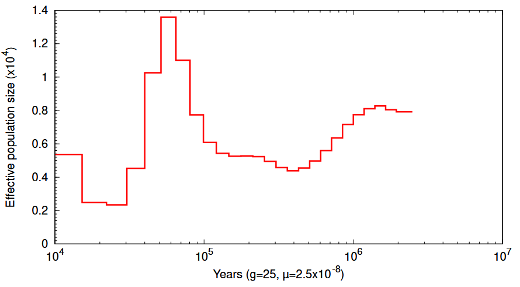

## PSMC and SMC++

Today, you'll see how to run `PSMC` and, in principle, `SMC++`. You only need to run one, and it's your choice which. `PSMC` is more likely to be useful to you if you have no idea what quality of sequencing you'll deal with in the future. `SMC++`, meanwhile, has more bells and whistles (and is frankly easier to run), but works best if you have hundreds of sequences. Since I'll have you use human data from a few labs prior today - you already have hundreds of sequences, so feel free to follow the `SMC++` instructions.

### PSMC

First, install `PSMC` from [here](https://github.com/lh3/psmc), or load a module if available.

Second, we'll need to do some data prep. `PSMC`s input is a consensus sequence for a single individual, including some quality data. This is fairly simple to generate using the `bcftools consensus` approach.

In the case of the human data of chromosome 22 you worked on a few weeks ago, feel free to choose any single individual sample. You can check your samples table to see what population some individual belongs to.

You can then run the following in bash (either on your machine or the cluster), but you'll need the human reference sequence first. I've included chr22.fa in the git directory. You will also need a second tool: `seqtk`, in order to process the files. The whole process is actually quite backwards, since `PSMC` uses a proprietary FASTA-esque format that only they have scripts to convert to.

```{bash}
sample="YOURSAMPLENAMEGOESHERE"
psmcdir="PATHTOPSMCINSTALLATION"
bcftools view -s $sample subsampled_chr22.vcf.gz -Oz -o ${sample}.vcf.gz
seqtk mutfa chr22.fa <(gzip -dc ${sample}.vcf.gz|${psmcdir}/utils/vcf2snp.pl -) | seqtk seq | {psmcdir}/utils/fq2psmcfa - > ${sample}.psmcfa
```

This should generate the psmc requisite file for your sequence. In your own data, you can use a slightly different approach if you have the raw reads for your sample. Once you have aligned them, you can then run:

```{bash}
 ref="YOURREFERENCE.FA"
 samtools mpileup -C50 -uf ${ref}.fa ${sample}.bam | bcftools view -c - \
      | vcfutils.pl vcf2fq -d <lower_quartile_depth> -D <upper_quartile_depth> | gzip > ${sample}.fq.gz

${psmcdir}/utils/fq2psmcfa -q20 ${sample}.fq.gz > ${sample}.psmcfa
```

And you'll have the same pre-requisite files, but now filtered.

Now that you have the files ready, runnning psmc is a single line:

```{bash}
${psmcdir}/psmc -N25 -t15 -r5 -p "4+25*2+4+6" -o ${sample}.psmc ${sample}.psmcfa
```

This might take a minute if you are running on your own computer, but once it's done you should have a file that contains the results. As it runs - what are the parameters? `-N` specifics the maximum number of iterations (here 25). `-t15` identifies the maximum coalescent time (a multiple of $2N_0$). `-r` specifies the initial $\theta/\rho$ ratio which is optimized over the course of the run, and `-p` specifies the bins that demography will be estimated in. The above pattern is the default for the human phylogeny - a bin of size 4, 25 bins of size 2 and then a 4 and a 6. The "size" of these depends on the parameter choices, and ideally each timespan contains at least 10 recombination events. How you determine that is essentially by fidlling with `-t` and `-p` until you either feel confident, or get tired of fiddling with the parameters. Ideally, each time period is meant to contain about \~10 recombination events in your data, but there is no hard rule for how to determine that.

Generally, you will also want to bootstrap your runs (by runnning on subsets of the data). The guide for this is available on the psmc git page.

Finally, you will want to plot the results. `PSMC` includes a useful script for this, although consider writing your own `R` code to plot.

```{bash}
${psmcdir}/utils/psmc_plot.pl ${sample} ${sample}.psmc
```

That should produce the following:



This plotting does a few things by default, setting the human generation time (25 years) and mutation rate (although the mutation rate has some estimation that happens during the run). The population size is scaled relative to $N_0$ - the current population size. So, the numbers you see are not necessarily meaningful off the bat for your system - you'll need to do some conversions to figure out what they should be in your case. Pro tip - if you see the x axis look exactly like this in a publication and the system is not humans - it's possible the authors never really fiddled around from default parameters. That could be fine - the default parameters turn out to work well enough for many systems. But also - that means they likely just ran the tool rather than understand what it's meant to do, so take some caution in interpreting those results. 

### SMC++

SMC++ is distributed as a Docker image. If you have not dealt with these before, come chat with me, but the short version is it comes with its own virtual machine setup that includes all of the correct package versions and compiled code inside. This has many advantages - in most systems it will run fairly quickly and will only need you to have Docker installed, versus managing many other dependent packages. But, it also has some inherent issues (some clusters don't allow containerized runs because you can't actually see what they are doing inside and bad actors might have used them to mine crypto, for instance).

But, it doesn't need you to do any conversions for the VCF - just pop your VCF in and go. So, in that way, it is far simpler.

Follow instructions here: <https://github.com/popgenmethods/smcpp>

For the human chromosome 2 data, you should focus on one of the human populations. Creating the command line to go from vcf to processed file might seem tedious, but you can make life very easy for yourself using something like `awk`, e.g.:

```{bash}

awk 'BEGIN{printf "smc++ vcf2smc subsampled_chr22.vcf.gz chr22.smc.gz chr22 Pop1:"};$4=="FIN"{printf $1","}' samples_for_introgression.txt
```

This will leave a single hanging comma at the end, but it'll print out a command with all of the individuals for some population formatted how `SMC++` prefers.

You can then just run the estimation:

```{bash}
mkdir analysis
smc++ estimate -o analysis/ 1.25e-8 chr22.smc.gz
```

Here, you do need to specify the per generation mutation rate, but the number of bins is estimated for you.

Again, it has its own plotting utility, but take a look at the output files - they are fairly readable.


## PHLASH

This one runs better if you have a GPU, but will run even without (albeit slowly).

Install from [here](https://github.com/jthlab/phlash).

Unlike the other appraoches, this one lives primarily inside Python, so follow their markdown notebook guide:

https://github.com/jthlab/phlash/blob/main/notebooks/example.md

This will actually also use chromosome 22 data, but the guide is all in `python`, so beware.