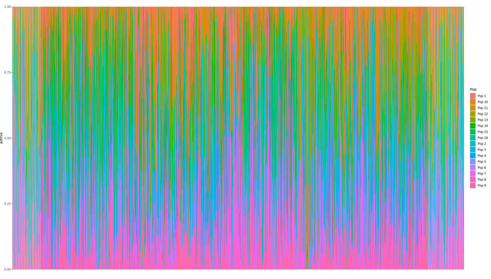

# Lab 5 - Test data and Population Structure

Today's goal is two-fold. First, we'll write a very basic test vcf for which you know the answers for various functions you've written. This + the functions we've written so far will be your first assignment (expect details on submission soon, but if you've kept up with the work so far - you shouldn't have to do much at all).

Second, we'll run some population structure analysis using PCAngsd. To do this, you'll need to convert your .vcf to a PLINK format, so if you havent' yet used Plink, today is the day.

## Writing unit tests

You have likely already been doing an informal version of this as you run your code. You know, for instance, what some functions should return in various cases. For a simple example, if you have a GT matrix that is nothing but 1s - your freq_GT function should return a vector of 1/2s (or 1s, if you specify the ploidy is haploid.) *Unit tests* are a minimal test to check each small, isolated unit of code you write. In your case, these are each of the functions that we write.

How do you write test cases for yourself to make sure the code actually works? A good test case will have several different tests to run. The first few are pure sanity tests, where the answer is painfully easy to calculate. So, if we are preparing a test-dataset for our code, we'd probably want at least a few sites that are invariable, because the expectation for `freq_GT` and `D_ij` is clear.

The below block of code generates the start of such a table:

```{r}
#Generating test data
row_invariant = rep(0,10)
row_invariant2 = rep(1,10)
one_tenth = c(1,rep(0,9))
one_half_fst1 = c(rep(0,5),rep(1,5))
one_half_fst0 = c(0,1,1,1,0,0,1,1,1,0)
fake_data = rbind(row_invariant,row_invariant2,one_tenth,one_half_fst1,one_half_fst0)
names(fake_data) = c("A","B","C","D","E","a","b","c","d","e")
#We also want the rows to have names that work with our code:
row.names(fake_data) = paste("chr1:",1:5*100,":A:T",sep="")
write.table(fake_data,file="<your test_dir/test_data.txt>",quote=FALSE)
pop_file = data_frame(samples=names(fake_data),population=c(rep(1,5),rep(2,5)))
write.table(pop_file,row.names=FALSE,quote=FALSE)
```

### Where should test data live?

Ideally you make a folder wherever you store your long term code that's just called `test`. It should include 1) test data, 2) testing scripts.

The test data is something that, with care, you should only need to curate once. On the other hand, the testing scripts will be continuously updated. It should have *a* test run for each of your functions.

```{r}
#Load in your code
include("your_src_file.R")

#Load in test data

test_data=read.table("your_test_data")
pops = read.table("your_test_pops")
#These are tests
#Assuming diploid
allele_freqs = apply(test_data,1,freq_GT)
if(allele_freqs == c(0,0.5,0.05,0.25,0.3)){
    print("Diploid freqs ok.")
} else {
    print("Diploid freqs broken!")
}
#Assuming haploid
allele_freqs_hap = apply(test_data,1,function(x) freq_GT(x,1))
if(allele_freqs == c(0,1,0.1,0.5,0.6)){
    print("Diploid freqs ok.")
} else {
    print("Diploid freqs broken!")
}

#And copy more or less the above for every function you write, with output corresponding to what you _should_ get at each locus.


```

This is tedious! It is hard to remember to do, especially when project deadlines loom. But it will save you ages of time hunting down *what* has broken when you've changed something in the code. If you decide to go down the route of developing your own package, there are simpler tools to use that automate at least a part of this (testhat)\[https://testthat.r-lib.org/\] for instance will help with generating test pass messages for simple test data sets.

How many versions should you test of each function? This depends on your code, and on what you actually

### More complicated test data

The second set of bits you want to include in your data are potential edge cases - things that might break the code if you forgot to deal with it. This doesn't have to be super robust for your own code for this class, but consider how you might need to make sure functions work for multiple ploidies. What you *should* worry about is missing data. The easiest way to make sure you are dealing with it correctly is to use the same data as before, but now add some noise:

```{r}
#Make some fake data with missing values. Figure out expected returns for unit tests.


```

### What about things you *can't* test?

You'll find frequently that you'll work with new data/new approaches where the expectation for some function might be completely unknown (or stochastic). These are the cases where you need to be extra careful, but there are still some coding tricks you can use to make sure you don't run a big analysis for a few months to only later find out it failed at step 2. Some tests don't have to provide a specific value, but should at least check if *something* about the output looks correct.

For instance, you might have a method that returns a gene tree. If you know that gene tree should be rooted, you could add a test like:

```{r}

test_tree = your_function(some_data)
stopifnot(is.rooted(test_tree))

```

This won't provide a nice printed output, but at least it'll break and force you to go check your tree early. Indeed, it's a good idea to add `stop_if_not` or `assert` statement (from the `assert` package) inside your functions whenever you make an assumption about what the data *should* behave like. Again, this takes time and effort, so it's a fine balance of realizing where common issues could crop up and fixing those, instead of taking time to idiot proof your code against all possible errors (which you will never achieve regardless).

## Short assignment 1: `GT_process` that runs correctly on a test data set.

Your first short assignment is to put together everything we have been learning so far into one workable function that will process a genotype table to output a series of population genetic results. Your function should:

1)  Take a genotype matrix and a sample table as input.
2)  Return individual site frequency across the genotype matrix for each population.
3)  Return site sample heterozygosity for each population.
4)  Calculate all pairwise $F_{ST}$ values for all pairs of samples.
5)  Return average $r^2$ correlation within each population.
6)  Work on *your* test data set for which you will know the answers to these questions
7)  The test data should have at least 3 populations, and at least 40 sites.

I've given you code already that more or less does 1-4 (but, *you* are responsible for any debugging). You'll realy only have to implement #5 and make test data, and present the code in a workable way. But, work on making a test data set that actually tests the potential issues you have bumped into so far.

The assignment will be due Oct 10th, so you have time (and individual meetings with me) before it's actually due.

## Plink and PCAngsd

Let's now move on to new things. In the interest of not introducing a bunch of new `R` stuff to work on while you sort out the assignment, today we'll be working almost entirely from the command line. Today's goal is to work on code that processes a vcf to produce population structure output.

### Step 1: Have access to a UNIX terminal

If you are on a windows machine, we'll need to make sure you have access to a UNIX terminal. Two ways to go about this - if you already have access to the HPC, feel free to work from there. The recommended option is to install `WSL2`. This is a lightweight virtual machine that will give you full Linux capabilities from inside of Windows. It's very useful to test code/pipelines before running them on the cluster. Instructions depend partially on Windows version, but the currently recommended version seems to be: go to the Microsoft Store, type in Ubuntu, install Ubuntu. This *will* require a restart before you can actually run it.

### Step 2: Install conda/miniconda

Managing software packages is easiest with virtual environments, and Conda is the way to go for most bioinformatics tools. I'll recommend Miniconda, as it's a bit more lightweight: (instructions here)\[https://www.anaconda.com/docs/getting-started/miniconda/install#macos-linux-installation\]. DO NOT install using the graphical installer - we'll need to work from the terminal today.

### Step 3: Create a new virtual environment

Once conda is installed (you may have to restart your terminal), you should be able to create an environment for today's goals. Let's call it `pcangsd`. In your terminal, type:

```{bash}
conda create -n pcangsd
conda activate pcangsd
pip install pcangsd
```

### Step 4: Install Plink

Plink is the next tool we'll need. It's an easier install than PCAngsd, but still has some potential issues. If you have a fresh install of Ubuntu, you'll first need to install `unzip` with:

```{bash}
sudo apt install unzip
```

You'll type in your password and should get unzip installed.

Then, download Plink (copy the appropriate link from this site (either Linux 64 bit or MacOS))\[https://www.cog-genomics.org/plink/\]

For Linux (Windows too!) use this:

```{bash}
wget https://s3.amazonaws.com/plink1-assets/plink_linux_x86_64_20250819.zip
unzip plink_linux_x86_64_20250819.zip -d plink/
```

You will now have a directory called plink with a few files inside it.

## Run PLINK on the muc19 data to make .bed .fam files

Next we need to prepare the vcf in the necessary format. This will look like

```{bash}
plink --vcf <your_vcf> --make-bed --out <output_prefix>
```

## Run PCAngsd

Almost to the finish line, we can run PCAngsd:

```{bash}
pcangsd -p <output_prefix_from_previous_step> -o <output_prefix_for_this_step> --admix
```

Now it will run for a little while. Or a very long while for large datasets. What will be produced is the covariance matrix for your data, and estimates of admixture given the $K$ based on the PCA. You might notice this $K$ is *weird* given what you know about the data here, but let's take a look at the data in depth:

```{r}
admix = read_table("<your_output_prefix>.admix.<K>.Q")
head(admix)
```

Each row is an individual, each column is the proportion of ancestry for that individual in that population. How can we plot this?

```{r}
require(ggplot2)
require(tidyverse)
names(admix) = c("","") #Give some putative names for the populations, depening on their number

admix= as.data.frame(admix)
admix$ind =  ??? #How can you name each individual (hint: the vcf has the names of each of these)
#Pivot to long format
df_long = pivot_longer(admix,1:<your K>,names_to="Pop",values_to="admix")

ggplot(df_long,aes(x=ind,y=admix,fill=Pop))+geom_col(col=NA)

```

At the end, you *should* obtain a plot that looks something like (except here it's all 3202 individuals):

