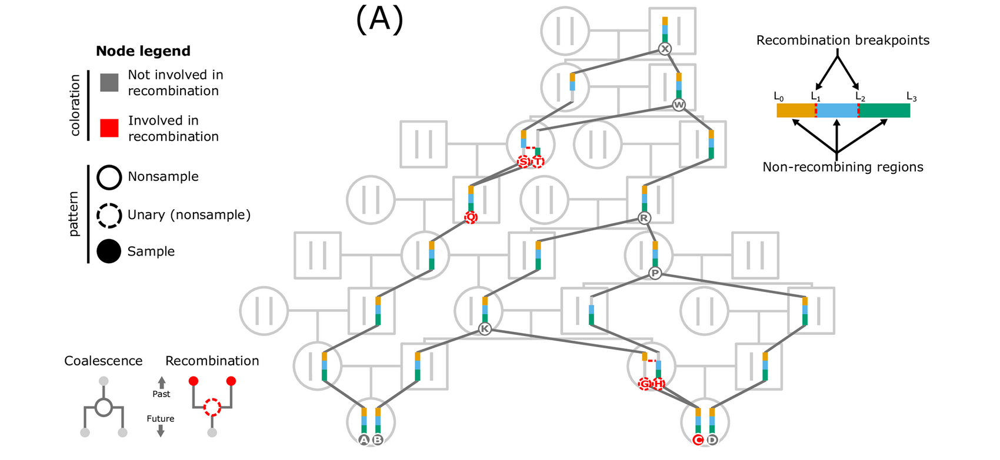
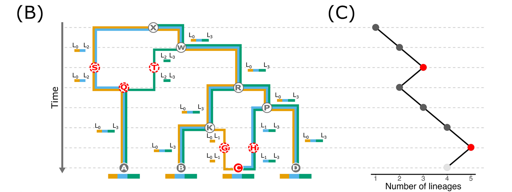
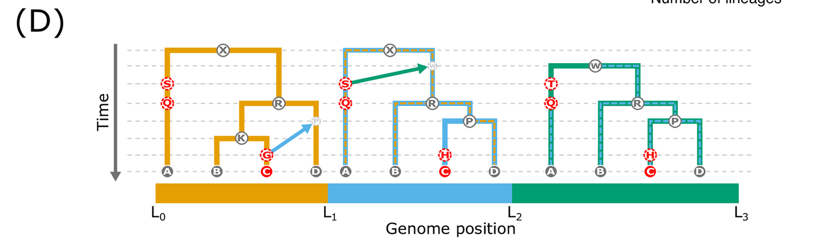
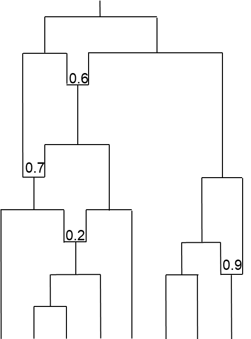
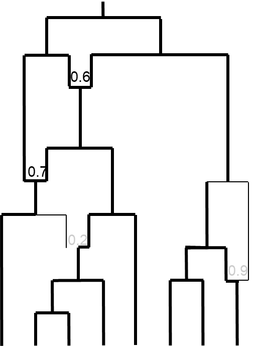
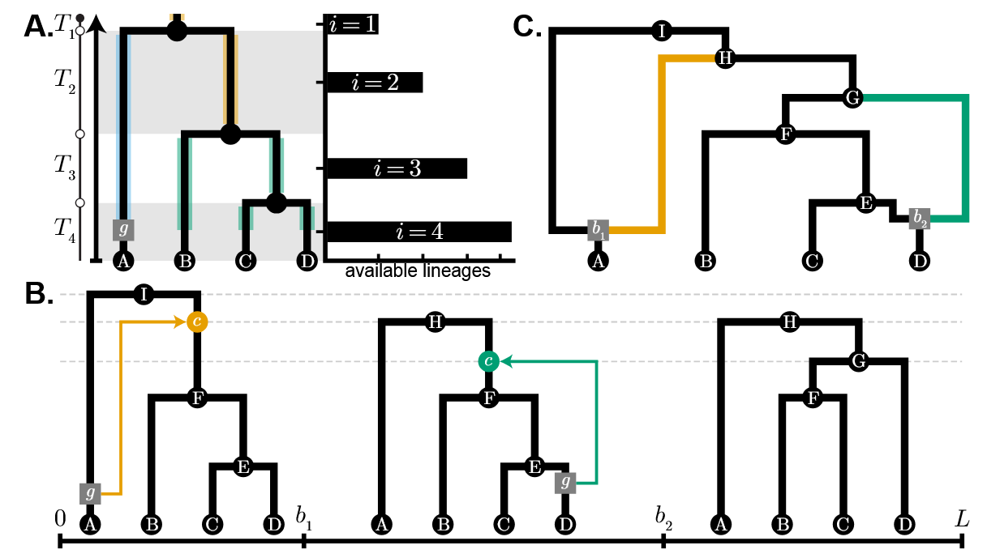
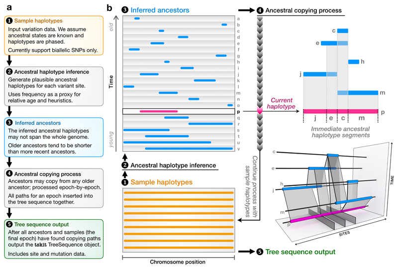
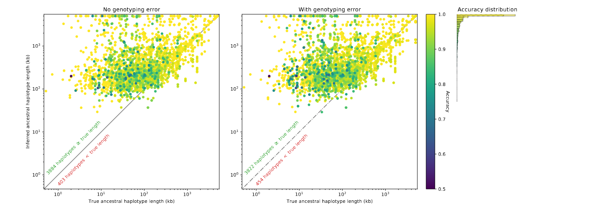

## Genealogies along the genome

Last week - evolution is really complicated, so yoo'll never *really* know the full history of a population.

. . .

This week - the holy grail of population genetics - a description of the (nearly) full evolutionary history of a population.

. . .

We'll look at extensions of the coalescent - the Ancestral Recombination Graph, and many approaches meant to approximate it.

. . .

We'll show how obtaining the full ARG is more or less impossible, but approximations can extract quite a bit of information.

## What is the ARG?

The ARG is the full geneology of all genetic material in your samples.

. . .

This is distinct from the coalescent, since different parts of the genome can show different geneologies. E.g.: you've inherited different parts of the genome through different lineages.

. . .

Simplest case - two unlinked markers: say mitochondrion and a Y chromosome in a male.

. . .

The mitochondrion is descended entirely through female line, the Y through male - their geneologies don't overlap all teh way back until the evolution of the Y chromosome.

## Less extreme - two alleles on same chromosome {.smaller}

As we trace the geneology of a pair of samples, two things can happen:

1)  Coalescence event - we've talked about this, and its rate is $1/2N$.

2)  A recombination event - this is proportional to $\rho$.

. . .

Only thinking about coalescence makes life easy - each coalescent event reduces the number of lineages we need to track.

. . .

Recombination, on the other hand, creates *new* lineages to keep track of.

. . .

When recombination rates are high ($r \approx 0.5$), the number of lineages to keep track of grows *extremely* quickly.

## Example



[@Lewanski2024]

## Another way to portray an ARG



## The third way:



## This is only a few regions - how many in real samples? {.smaller}

Here, we assumed god came down and told us that there are two recombination events (and ergo three segments) - how many are in real data?

. . .

This is part of the difficulty in estimating the ARG - finding the boundaries of two different potential histories.

. . .

Naturally - depends on the total recombination map length.

. . .

How many segments? Each recombination even adds roughly one, but as you'll see, hard to predict how many total recombination events happen.

. . .

In practice, there are roughly $~1+\rho/2$ segments, where $\rho = 4Nr$ and $r$ is the total distance across chromosome.

## Will we ever coalesce? {.smaller}

One approximation - instead of simulating the whole genealogy, we do similar approach to coalescent with migration estimates: enumerate all rates and choose events based on their relative rates:

1\) Coalescence with rate \~ $\frac{1}{2N}  \frac{n(n-1)}{2}$, where $n$ is the number of remaining lineages.

2\) Recombination with rate \~ $\frac{\rho}{2N}\frac{n}{2} = \frac{4Nrn}{4N} = rn$.

. . .

Recombination/coalescence is therefore:

$$
\frac{\rho}{n-1}
$$

## Relative probabilities

```{julia}
using Plots, Measures, LaTeXStrings
theme(:wong)
default(dpi=400,xlabelfontsize=16,ylabelfontsize=16)
function rec_coal(rho,n); rho/(n-1);end

ns = range(2,100,length=99)
rho1 = rec_coal.(0.1,ns)
p1=scatter(ns,rho1,label=L"\rho=0.1",xlabel="Remaining lineages",ylabel="Rec/Coal rate",yscale=:log10)
rho2 = rec_coal.(1,ns)
rho3 = rec_coal.(10,ns)
rho4 = rec_coal.(100,ns)
scatter!(p1,ns,rho2,label=L"\rho=1")
scatter!(p1,ns,rho3,label=L"\rho=10")
scatter!(p1,ns,rho4,label=L"\rho=100")

```

## Do we care about *all* recombination events?

Recombination events in individuals among segments not inherited to our samples don't actually matter.

. . .

Even in the worst case of very high recombination rates, we eventually create lots of infinitesimal segments that are unlikely to recombine, and so are forced to coalesce.

. . .

Recombination only creates new lineages when it splits apart segments we are keeping track of.

## What this means

Because coalescence rates grow quadratically, but recombination linearly with $n$, you will *eventually* coalesce back to a single ancestor.

. . .

But, the coalescence of the last few samples takes extra long when $\rho$ is large - keep splitting into different ancestries during the longest waiting time.

. . .

Whereas before the MRCA of 2 samples is on average $2N$ generations back, it now is longer, but quite hard to derive exact results.

## Why care about the ARG? {.smaller}

So, we know that, mathematically, you can eventually get the full genealogical history of a sample.

. . .

That history contains the *full* information about what has happened in the ancestors of your samples.

. . .

For instance: $F_{ST}$ is a summary statistic of how much variation is shared, but this would just be proportional to the cross-coalescence of two populations.

. . .

Almost all population genetic statistics can be shown to be lower dimension summaries of the ARG (from $\pi$ to $\theta$ to the SFS and even LD).

. . .

If we knew the ARG, we would know all of these things.

## Estimating an ARG for a sample

To first think about how/why it's hard to estimate the ARG, let's think back on estimating the coalescent.

. . .

Suppose we have two samples that are different by $k$ mutations. We can actually observe these, unlike coalescent history.

. . .

From pure coalescent theory, we know that the number of expected differences is $4N\mu$, so if we have an estimate of $\mu$, we can figure out the coalescent time in units of $4N$.

. . .

Even if we don't know $\mu$, we can tell the relative coalescent times for, say, different pairs of samples simply because their numbers of mutations will be different.

## Adding recombination {.smaller}

When adding recombination, we now not only don't have an exact solution for expected coalescence time (and therefore total expected mutations), but different segments may have different *marginal* histories.

Say we have the following:



## How to estimate using real data?

The real data we have is mutations.

. . .

Some samples will simply be more/less related to each other in some *parts* of the chromosome due to the ARG.

. . .

Even if we have perfect mutation/recombination rate knowledge, there are many evolutionary histories that are consistent with observed mutations.

. . .

The parameter space to explore is gigantic even for a few samples, since recombination means the number of lineages to keep track of is not $1:n$, but $1:\infty$, even if the tail of the distribution is *very* thin.

## The full ARG - impossible to obtain  {.smaller}

The full ARG contains the genealogy of the full set of sequence for all of your samples.

. . .

In principle, it contains all of the information about demography, selection, mutation, recombination that occurred in the population.

. . .

The absolute full ARG is practically impossible to estimate, simply because many lineages relevant to the current samples did not leave behind any DNA in your sampling. As you sample more to try and get at these lineages, you increase the computational difficulty exponentially.

. . .

Methods to estimate the "full" ARG exist for just a few samples, but are extremely computationally complex (and limited to the amount of sequence that can be used).

## The marginal ARG  {.smaller}

If we examine some segment of chromosome, parts of the ARG are dropped.

. . .

{width="342"}

## Marginal trees

If we manage to only capture a single gene/segment, then we have a marginal tree for that particular sequence.

. . .

Here, we *can* use simple coalescent approximation approaches - no recombination along entire segment.

. . .

So, if we can tell where individual segments occur, we could at least get out some information relatively reliably.

## Sequential Markovian Coalescent

This is what the SMC approaches, like PSMC do.

. . .

Recall that PSMC uses a Hidden Markov Model approach - each base pair is considered to be in some state, where the states are different coalescent histories.

. . .

As you walk across the chromosome, you examine the number of differences between two haplotypes and estimate whether you are still in the same region as the previous state.

. . .

This lets you estimate the distribution of different coalescent histories, and therefore the coalescent rate.

## SMC more broadly: when a new "segment" occurs. {.smaller}



## SMC to estimate $N_E$ and other parameters. {.smaller}

As we've talked about before, SMC approaches can estimate the effective population size in the past by looking at the frequency of different "bins" of coalescence times versus their expected frequency.

. . .

SMC can, similarly, estimate the rate of recombination by calculating a composite likelihood of both segment size and number of coalescence events in your data.

. . .

You can further estimate migration rates between populations by looking at "cross-coalescence" rates between samples from different populations. They should primarily coalesce before populations split - any excess coalescence outside of this time gives estimates of migration rates.

. . .

In short: if you can model it using the coalescent (and that's pretty much everything in evolutionary biology), you can estimate it using some SMC approach.

## Big caveats {.smaller}

SMC and ARG are not magic. The samples that exist now show you the history of the samples that survived.

. . .

Say there was a disease outbreak that targeted cariers of a particular allele.

. . .

You may find evidence of selection, and even estimate the timing by looking at local reductions in $N_E$ for particular timepoints using SMC approaches - but you don't know what the removed variant was.

. . .

As with any model fitting, it's tempting to just fit *everything*. But, to fit everything you need more samples, and more samples means more genealogies. That means you are always running the dual risk of over-fitting by having complex models for few samples, and under-fitting by oversimplifying dynamics if you have many samples. There is no practical rule of thumb here - try multiple models and see how robust your results are.

## Practical approaches for ARG inference. {.smaller}

There are the purely SMC variants, generally meant to estimate demography (population sizes and migration rates):

-   `PSMC` [@Li2011]

-   `SMC'` [@Wilton2015]

-   `SMC++` [@Terhorst2017]

-   `MSMC`/`MSCM2` [@Schiffels2020]

. . .

Then there are ARG inference approaches, which do not, by themselves, give you demography, but give a good approximation of the underlying ARG for your data:

-   `tsinfer` (also does demography with `tsdate`) [@Kelleher2019]
-   `ARGWeaver` (also does recombination) [@Rasmussen2014][@Hubisz2020]
-   `ARG-needle` (also does GWAS) [@Zhang2023]
-   `Relate` (also does everything) [@Speidel2019]

## Which should I use?

If all you care about is demography - `PSMC`/`SMC'`

. . .

For practical purposes, `tsinfer` and its associated ecosystem has the best balance of newbie friendly and powerful.

. . .

One of the benefits of `tsinfer` is it is in the same ecosystem as `msprime` - probably the fastest/most advanced coalescent simulator around.

. . .

That means you can back up your inferences with many simulations along with your inferred parameters, but be aware its not even a pure SMC, it's a a "tree sequence".

## Tree sequences

Tree sequences are an "efficient encoding of genomic data."

{alt="_images/6483e37fd58cc7beba7f900cfb82e08f14bcb1ccc4131934badd5d81c394d1bb.svg" width="579"}

. . .

They are a "sequence of correlated local trees along the genome".

. . .

Essentially - a way of both representing a sequential set of trees *and* roughly approximate an SMC.

## `tsinfer`



[@Kelleher2019]

## Advantages over SMC

SMC approaches are *Markovian* - they rely solely on the previous state. But that means they are directional in their estimation.

. . .

`tsinfer` instead identifies ancestral tracts and their overlap - not (as much) directionality.

. . .

Can overestimate tracts!



## Reading for Thursday

A more efficient approach to estimate demography.

. . .

Will be compared to many of the approaches you see here, and to results we talked about in terms of bottlenecks/structure in ancient African populations.

. . .

Long and technical - read early/read often.

## References