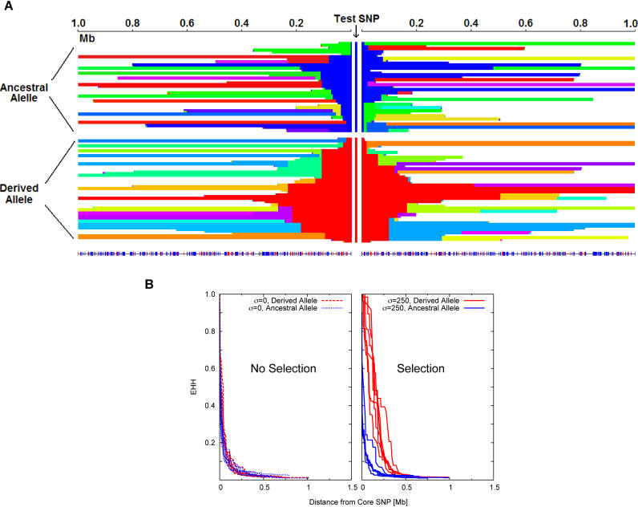

# Selection

Today's goals:

-   describe how selection on alleles can affect variation.

-   describe how selection on traits corresponds to genic selection.

-   revisit many of the results we have considered so far in light of selection.

## Reminder: what is selection? {.smaller}

. . .

Selection is most easily defined as the difference in reproductive outcomes of individuals.

. . .

How can we measure reproductive outcomes?

-   Number of matings.
-   Number of fertilized eggs/fruit.
-   Number of offspring.
-   Number of offspring who survive to reproductive age.
-   Number of offspring who survive to reproductive age *and* reproduce.
-   Long term growth rate *r*.
-   Population growth rates.

## Generally - stick to number of offspring.

How fitness is defined depends on your system. We'll focus on number of offspring.

. . .

Extremely general point: The frequency of an allele in the next generation directly depends on its relative fitness to the population in this generation.

. . .

Let $W$ be absolute fitness (number of offspring, etc.), then $w$ is the relative fitness $w = \frac{W}{W_{ref}}$ , where $W_{ref}$ is the reference fitness.

. . .

Relative to what? We will use different baselines, but the one that matters most is $\bar{W}$ - the average population fitness.

## Example

You are studying the root nodules in a species of *Mimulus*. You find that plants that have root nodules on average produce 200 seeds. Plants without nodules produce about 100 seeds.

. . .

What's the relative fitness of plants with root nodules?

. . .

Let's say half the population has root nodules. Then: $w = \frac{200}{150} = \frac{4}{3}$ .

If 99.9% of the population has root nodules, then $w \approx 1$.

. . .

Let's say it's 0.0001% of the population, so that $w \approx 2$. How common will root nodules be in the next generation?

## First limit of selection: genetic variance {.smaller}

Many traits may correlate to increased fitness, but selection cannot increase their frequency if they are not *heritable*.

. . .

Heritability comes in two flavors:

1\) Broad sense heritability: $H^2 = \frac{V_G}{V_P}$, where $V_G$ is the total genetic variance in the trait, and $V_P$ is the phenotypic variance.

2\) Narrow sense heritability: $h^2= \frac{V_A}{V_P}$, where $V_A$ is the *additive* genetic variance.

. . .

Simply - heritability is the proportion of phenotypic variance that is explained by genes.

. . .

It is *not* the proportion of the trait controlled by genetics - consider the number of eyes in humans.

. . .

Heritability is easiest to think about for continuous traits, so let's start there.

## Estimating heritability: linear regressions

One way to estimate heritability ($h^2$) is to examine parent-offspring regressions:

```{julia}
using Plots, LaTeXStrings, Measures, Distributions, GLM, DataFrames
theme(:juno)
default(xlabelfontsize=16,ylabelfontsize=16,margins=4mm,markerstrokewidth=0,markersize=2)

xs = rand(Normal(),1000)
ys = 0.2*xs+rand(Normal(),1000)
zs = 0.9*xs+rand(Normal(),1000)

p1 = scatter(xs,ys,xlabel="Parent average value",ylabel="Offspring value",leg=false)
lm1 = lm(@formula(y~x),DataFrame(x=xs,y=ys))
us = collect(range(-3,3,length=10))
vs = predict(lm1,DataFrame(x=us))
plot!(p1,us,vs)
annotate!(p1,[-2],[2],["slope = "*string(round(coef(lm1)[2];digits=2))])

p2 = scatter(xs,zs,xlabel="Parent average value",ylabel="Offspring value",leg=false)
lm2 = lm(@formula(y~x),DataFrame(x=xs,y=zs))
vs2 = predict(lm2,DataFrame(x=us))
plot!(p2,us,vs2)
annotate!(p2,[-2],[2],["slope = "*string(round(coef(lm2)[2];digits=2))])

plot(p1,p2,size=(1200,800))
```

## Big caveats: not all inherited correlations are genetic

If parent-offspring values are determined in a common garden - you probably are getting a good estimate of $h^2$.

. . .

But, in many cases, your data comes from the wild! There may be secondary correlates that are not genetic, but are inherited (the climate where you live, the nutrients available, inherited wealth, etc.)

. . .

How can we account for this? Not easy, but possible to look for direct vs indirect effect composition [@Song2023; @Barry2023].

## Selection on a trait cntd:

Before we give an exact result for what happens with selection on a heritable trait, let's develop some intuition graphically.

. . .

Imagine there's a threshold value for the trait: parents below this value simply leave no offspring, and the future generation is composed only of individuals whose parents had values above the threshold.

## In our toy data

```{julia}
threshold = 1
idx = findall(xs .> threshold)
cols = fill(:grey,1000)
cols[idx] .= :red
alpha = fill(0.6,1000)
alpha[idx] .= 1

p1 = scatter(xs,ys,c= cols,alpha=alpha,xlabel="Parent average value",ylabel="Offspring value",leg=false)
vline!(p1,[threshold])

p2 = scatter(xs,zs,c= cols,alpha=alpha,xlabel="Parent average value",ylabel="Offspring value",leg=false)
vline!(p2,[threshold])

plot(p1,p2,size=(1200,800))
```

## What's the new average among offspring?

```{julia}
hline!(p1,[mean(ys[idx])])
annotate!(p1,[-1],[1],"New mean ="*string(round(mean(ys[idx]),digits=3)))

hline!(p2,[mean(zs[idx])])
annotate!(p2,[-1],[1],"New mean ="*string(round(mean(zs[idx]),digits=3)))
S = mean(xs[idx])

plot(p1,p2,size=(1200,800))
```

## Formalizing: Breeder's equation

The Breeder's equation describes the effect of selection on a trait:

$$
R = h^2S
$$

Where $R$ is the response to selection (change in mean character), and $S$ is the *selection differential* - a measure of the difference in the mean value in the parents generation vs mean value of parents who got to breed.

. . .

In our case: the selection differential was \~1.5, $h^2$ was either 0.2 or 0.9, so $R$ \~ 0.3, 1.35.

## One special trait - fitness

Fisher's Fundamental Theorem:

$$
\Delta W = V_{G}(W)
$$

. . .

The mean change in fitness between generations due to natural selection is equal to the additive genetic variation for fitness.

. . .

Additive genetic variation is the directly heritable component *and* it determines the selection differential.

. . .

So, populations will slowly increase in fitness due to selection, until there is no (additive) variation for fitness.

## Does fitness increase forever?

FFT was not well regarded for a long while because:

-   Fisher is not an amazing writer

-   His idea was construed as suggesting guaranteed fitness increases every generation

. . .

Important to point out that he specifically refers to the change in fitness due to selection.

. . .

There is no guarantee that additive variance for fitness is available.

## What about an allele?

When we describe the heritability of alleles, we are now thinking about a discrete rather than continuous trait.

. . .

Heritability does not have quite the same meaning here - in some sense it is 1 (parent average == offspring average for autosomal alleles), but less intuitive to think of it this way.

## Relative fitness of an allele

Let's say you have the following relationships:

```{julia}
Ws = [100,150,200]
bar(["aa","aA","AA"],Ws,leg=false,xlabel="Genotype",ylabel="Number of Seeds",size=(1000,600))
```

## Convert to relative fitness

We often use the ancestral allele (or the major allele, e.g. the most common) as the reference point.

. . .

```{julia}
ws = [1,1.5,2.0]
bar(["aa","aA","AA"],ws,leg=false,xlabel="Genotype",ylabel="Relative Fitness",size=(1000,600))
```

## Look at next generation:

```{julia}
ps = [0.25,0.5,0.25]
Ns = Ws .* ps
bar(["aa","aA","AA"],Ns,leg=false,xlabel="Genotype",ylabel="Offspring",size=(1000,600))
```

## And then re-scale

```{julia}
ps2 = Ns/sum(Ns)
bar(["aa","aA","AA"],ps,leg=false,xlabel="Genotype",ylabel="Frequency in next generation",size=(1000,600))
```

## What will the allele frequency be in the next generation?

Let's spell it out fully:

-   `aa` individuals will leave behind $W_{aa} N_{aa}$ offspring

<!-- -->

-   `Aa` will leave behind $W_{Aa} N_{Aa}$

-   `AA` will have $W_{AA} N_{AA}$ offspring.

So, there will be $200N_{AA}+\frac{150}{2}N_{Aa}$ `A` alleles in the next generation in our example, out of a total of $100N_{aa}+150N_{Aa}+200N_{AA}$ individuals.

. . .

## Back to frequencies

Much simpler to convert to frequencies:

$$
p` = \frac{\frac{1}{2}W_{Aa}p_{Aa}+W_{AA}p_{AA}}{\bar{w}}=\frac{p(qW_{Aa}+pW_{AA})}{q^2W_{aa}+2pqW_{aA}+p^2W_{AA}}
$$

. . .

This is the most general way to think of the effects of selection on an allele frequency.

## Special case 1: positive selection:

Let $w_{aa} = 1;w_{Aa}=1+s;w_{AA}=1+2s$

Then:

$$
\Delta p = \frac{p(q(1+s)+p(1+2s))}{q+2pq(1+s)+p^2(1+2s)} -p = \frac{pqs}{1+2ps}
$$

. . .

While $p \ll 1$ , this is approximately $spq$

## Some similarities with Breeder's equation

The increase is proportional to the strength of selection ( $s$ vs $S$ ) and the amount of genetic variance ( $pq$ vs $h^2$)

. . .

What about other forms of selection?

## Limits of selection 2: drift

Recall that the change in an allele frequency due to drift is $\frac{1}{2N}$.

. . .

If $s \approx \frac{1}{2N}$ , then it's change is *at most* $\frac{1}{8N}$.

. . .

In other words - drift results in larger allele frequency swings than selection, especially while allele is rare.

. . .

If $Ns \ll 1$ : selection will not outcompete drift.

. . .

$Ns$ therefore becomes an important boundary line to determine the fate of an allele.

## Even for large $s$ - drift is a problem

While an allele is rare, the change in its frequency due to selection is *tiny*.

. . .

Many positively selected mutations are likely to be lost while rare.

. . .

If they survive this rare period, they are then nearly guaranteed to fix.

. . .

The probability of a positively selected allele going to fixation is $2s$ (assuming $s <1/2$)

. . .

## Beyond directional/positive selection:

Trait/allele relationships to fitness can fall into three broad categories each:

-   Directional/positive

-   Stabilizing/overdominant

-   Disruptive/underdominant

. . .

No time to derive results today, but can express long-term expectations for all of these.

## Very big important note

While the shape of fitness relationships is similar between different quantitative vs allelic forms of selection, they are not one to one.

. . .

A trait under stabilizing selection may be controlled by many alleles such that they are all under positive/negative selection - no overdominance needed.

. . .

Similarly, a trait under positive selection can be controlled by overdominant alleles.

. . .

The form selection takes on a phenotype *is not necessarily the same* as the way alleles are selected.

## What does selection *do*?

Let's recall how each of our forces operates:

| Process | Effect on genetic variation | Effect on LD | Effect on coalescence |
|------------------|------------------|------------------|------------------|
| Mutation | Increases | No direct effect | Increases |
| Drift | Decreases | No direct effect | Decreases |
| Migration | Increases | Increases | Increases |
| Recombination | No direct effect | Decreases | No direct effect |
| Selection | Depends | Depends | Depends |

It's hopefully clear now why we waited to talk about selection

## Positive selection {.smaller}

Positive selection (one allele favored), will decrease genetic variation (down to 0 if one allele is fixed).

. . .

If the genetic diversity decrease, then $N_e$ also decreases.

. . .

Coalescent times at this locus *also* decrease, consistent with a smaller population size.

. . .

Positive selection *increases* LD, but proportionally to how much LD already exists.

. . .

$$
D_{ij} \propto a_iD_{ij}
$$

Where $a_i$ is a normalized selection effect on the $i^{th}$ allele.

## Overdominance/Balancing selection

Balancing selection/overdominance/negative frequency dependence can maintain an allele at an intermediate frequency.

. . .

In this case, genetic diversity is increased by selection.

. . .

Consequently, larger $N_E$, and longer coalescence times.

. . .

LD is *still* increased in this case.

## Underdominance

In the long run, for individual populations, looks like positive selection.

. . .

Combination of drift and selection leads one allele to be fixed eventually.

## So, what does selection look like in the genome?

Demographic changes appear as *genome - wide* changes in $N_E$ (and therefore genetic variation, etc).

. . .

Mutation and recombination often change across different regions of the genome, but also apply to large regions.

. . .

Selection will affect a region, the size of which depends on the type and strength of selection.

## Limiting case 1: *really* strong selection

We can show that the time for a positively selected allele to go from 10% to 90% is roughly equal to $4/s$

. . .

Let $s=1$, that is, a full doubling of fitness compared to the ancestor.

. . .

It will roughly take 4 generations to go from 10% -\> 90%.

. . .

That is 4 generations for recombination to break apart any LD between the allele and any nearby neutral sites.

. . .

Also 4 generations for selection to build up those associations.

. . .

In this case, you would expect nearly the whole chromosome containing the positively selected allele to have low genetic diversity (and other chromosomes would be impacted as well).

## Limiting case 2: nearly neutral allele

Let's think of an allele at the limit of selection's capability: $s=\frac{1}{N}$. Then, it will take the allele approximately $4N$ generations to go from 10% -\> 90%.

. . .

Recall that the coalescence time for two *neutral* sequences is $2N$.

. . .

In this case, recombination has many generations to break apart LD, and LD build-up is practically non-existent - the genetic neighborhood will look more or less like a neutrally evolving sequence.

## In-between: reduced diversity, increased LD

Selection will cause an area around the selected site to have reduced genetic diversity and increased LD.

. . .

This signal will decay following the allele's fixation.

. . .

We can perform several different statistical tests to look for evidence of this kind of sweep.

## Tajima's $D$ {.smaller}

Tajima's $D$ measures the difference between $\pi$ and $\theta_W$ - two estimates of diversity, one based on the number of pairwise differences between randomly chosen sequences, the second based on the number of segregating sites.

. . .

The intuition: Heterozygosity decreases more rapidly than the number of segregating sites when there is positive selection.

. . .

There is an abundance of *rare* alleles compared to the number of different haplotypes.

. . .

On the other hand, balancing selection will push allele frequencies up, leading to a deficiency of rare alleles compared to the number of different haplotypes.

. . .

Tajima's $D$ measures this:

$$
D = \frac{\pi - \theta_W}{\sqrt{Var(\pi-\theta_W)}}
$$

## Interpreting Tajima's $D$

Genome-wide Tajima's *D* indicates patterns of demography:

-   $D <0$ : recent bottleneck

-   $D > 0$ : population expansion

-   $D = 0$ : evolving under mutation-drift equilibrium

. . .

$D$ within individual genomic regions can indicate selection:

-   $D <0$ : recent sweep

-   $D > 0$ : balancing selection

-   $D = 0$ : evolving under mutation-drift equilibrium

## Site-Frequenyc-Spectrum

One way to see this better is to think about the Site-Frequency-Spectrum.

. . .

Recall that when the population evolves with nothing but mutation and drift, the SFS looks like an exponentially distributed curve: many rare alleles, few common.

. . .

When you have a selective sweep in a region, one allele goes to fixation, and drags others along.

## SFS cntd:

This leads to an increase in the right hand side of an unfolded SFS.

. . .

If we fold it back, that means the slope of the curve looks steeper.

. . .

The SFS can be used to calculate both $\pi$ and $\theta_W$, so the correspondance is direct.

. . .

What about balancing selection?

## Using LD to look for selection

We already mentioned several approaches to calculating extended haplotype homozygosity scores.

. . .

$EHH$, $iHS$ and similar look for regions with long chunks of homozygosity [@Voight2006]

. . .

{width="683"}

## Big caveats

Approaches to look for selective sweeps often use a combination of statistics, including looking for local reductions in genetic diversity, increased LD, etc.

. . .

But these are all compared to a our "standard neutral model" - a Wright-Fisher population with mutation, drift, and nothing else.

. . .

While the *mean* value for Tajima's $D$ will change in predictable ways due to demography, the *variance* in the underlying genetic variation is not easily summed up by a single parameter.

. . .

In ideal scenarios - you simulate populations resembling yours, and look for regions of the genome that exceed the windowed Tajima's D/iHS/Fst that you actually observed.

. . .

But, you don't know the real demographic history unless you can exclude any parts of the genome under selection, and that is what brought you here in the first place.

## Not hopeless

As we'll discuss in the next few weeks, while each of the evolutionary forces is entangled with each other, we *can* make very good educated guesses by building evidence from multiple different approaches with different strengths/weaknesses.

. . .

That requires you to build a strong sense of intuition for what these different statistics mean. This week for reading: we'll look at how chromosomal inversions can impact many genome-wide statistics.

. . .

Next week: individual meetings. Sign ups should be open, let me know if no time works for you.

. . .

For your meeting: come prepared with either a data-set you know you want to work on, or ideas of what system you'd like to look at. No strict minimums on data quantity, but think of a tractable system (no giant analyses in pines or salamanders please).

## References