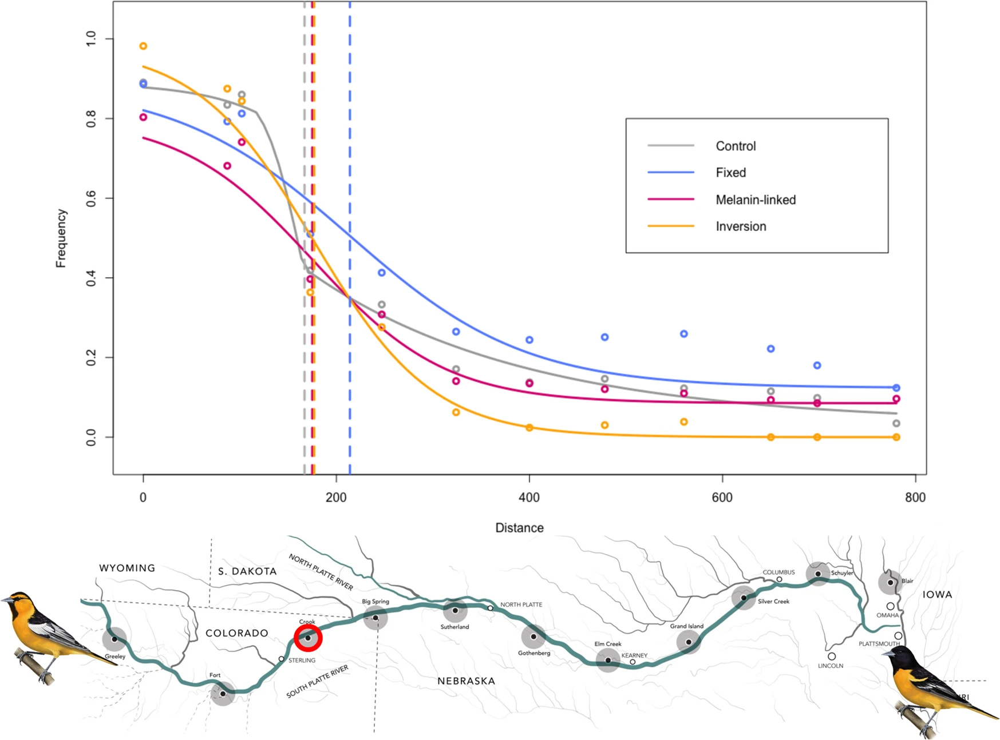
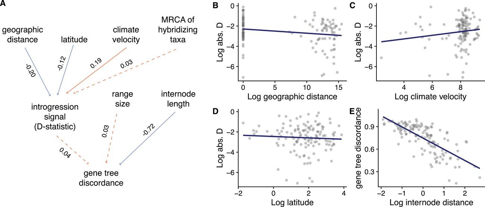
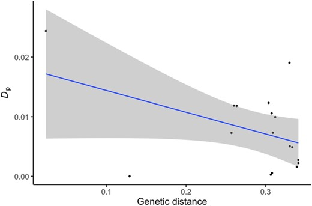
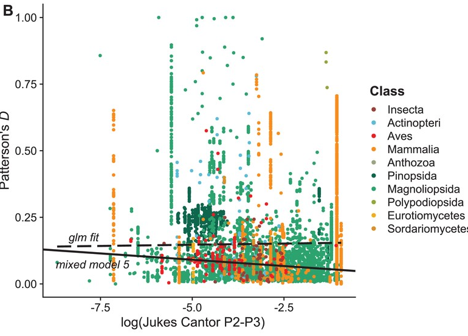
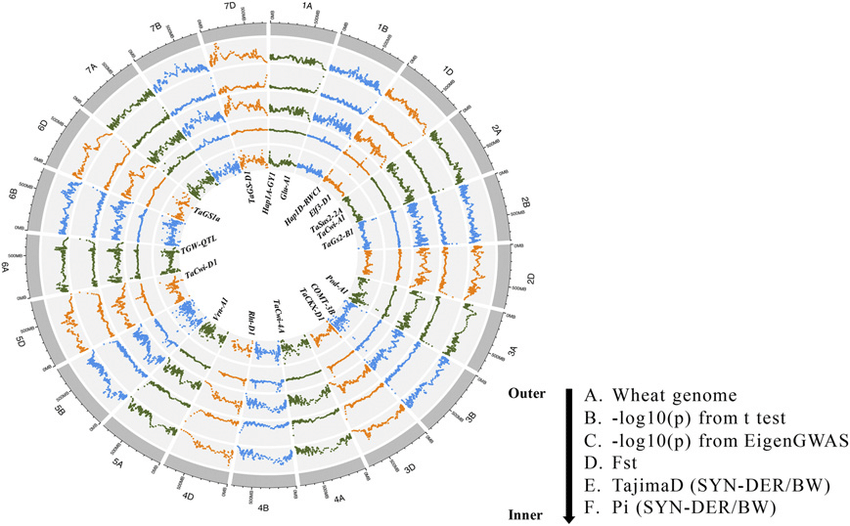

## Today's plan

The interplay of each different force on allelic frequencies.

-   Mutation-selection balance
-   Mutational load
-   Migration-selection balance
-   Consequences of divergence on migration/selection
-   Detecting migration/introgression

## Mutation-selection balance

We discussed earlier in the semester how mutation re-introduces variation even as selection acts against it, but we didn't think about it much more in-depth than that.

. . .

A consequence of constant mutation rates is that even when traits are strongly selected, mutations will introduce the deleterious allele.

. . .

The dynamics here *can* be complicated, but they are easiest to think about when we only consider mutation from the reference allele `a` to a deleterious allele `A`.

## Simplest model all semester?

Let's look for a steady state:

Each generation, there are $\mu (1-p)$ mutations introduced.

. . .

If we recall directional selection, there are $s p (1-p)$ mutations removed by selection.

. . .

$$
\begin{array}{rlr}
\Delta p  = & \mu (1-p) + sp(1-p)  & ,p \ll 1\\
\Delta p  \approx & \mu + sp & ,\Delta p = 0\\
\hat{p}  = & \frac{\mu}{s} \\
\end{array}
$$

. . .

That's nice and simple!

## Consequences for genetic diversity (and fitness) {.smaller}

We already talked about how selection is limited compared to drift.

. . .

Turns out, selection is also limited in how it can maintain deleterious alleles in check.

. . .

Each individual allele may contribute very little to polymorphism ($\mu \approx 10^{-8}$, $s <0.01$, so $\hat{p} < 10^{-6}$). But there are *many* such alleles.

. . .

The result is *mutation load* - the population fitness is suppressed by constant influx of deleterious mutations. How large is this decrease in fitness? Let's work it out on the board.

. . .

Load only affected by mutation rate, not strength of selection. Thankfully, mutation rates are low. But, in humans - 10-15 recessive deleterious mutations expected per person[@Henn2015].

. . .

Debated whether there's differences between human populations. Some evidence for increased mutational load in Out of Africa populations. Why?

## Mutational Load (cntd.) {.smaller}

One way to estimate the fitness cost of mutational load across the genome comes from Haldane:

$$
L = 1-e^{-2U}
$$

Where $L$ is the mutational load (equal to $\frac{W_{max}-\bar{W}}{W_{max}}$) and $U$ is the average number of new (deleterious) mutations per genome per generation. Notice selection does not appear!

. . .

In most species, $N\mu \approx 1$. If all of the new mutations were deleterious, that implies $L = 0.86$. In practice, we estimate that \~at least 60% of mutations are neutral-positive. So, $L = 0.55$ - still huge! But spontaneous abortion rate in humans also about 60%.

## Ongoing selection has a cost!

There's a second issue with mutational load - constantly introduced deleterious variation is selected against.

. . .

This means that in any generation, there are potentially many deaths due to selection on this variation.

. . .

Two issues: 1) This has a population level cost. 2) This has effects on linked regions.

## Population load, or why are we not dead 100 times over? {.smaller}

If selection happens because of *death* of individual, high load implies that population sizes are much smaller than they could be. In the extreme, these values are bizarrely high.

. . .

In a classic paper by A. Kondrashov [@Kondrashov1995], he noted that given load estimates at the time, each individual should carry \~100 lethal mutations.

. . .

One solution: selection is *soft* : competition between individuals rather than death.

. . .

An alternative: selection is stabilizing rather than purifying - this reduces the fitness effect of having many deleterious mutations, since their average effect might bring you close to optimum (Fisher's Geometric Model logic here).

. . .

In either case, mutational load may play an important role in conservation: as populations shrink, effect of selection decreases, so more deleterious mutations may be found in higher and higher frequencies.

## Main take-away from mutation-selection: not all variation is good!

There are two main ways data is often misinterpreted:

1)  No diversity == selection.

2)  High diversity == no selection.

. . .

Diversity not necessarily zeroed out at selected sites, even if on average it is lower.

## Background selection

The second effect of reintroducing these deleterious alleles is that linked variation is also purged.

. . .

Even when there is no direct selection at a site, purifying selection at nearby alleles can cause fitness to decrease.

. . .

This is going to play a stronger role in parts of the genome with less recombination.

## Background selection and null models

Recall that we frequently need to know something about the demography/population structure to infer other evolutionary processes accurately.

. . .

The problem we posited was determining what part of the genome was neutral.

. . .

One common approach is to look at four-fold degenerate sites - What is an obvious issue now that you know more about background selection?

. . .

A different approach is to look at alleles far from genic regions. Is this better? Why or why not?

## Inbreeding load {.smaller}

The other form of genetic load comes from non-random mating.

. . .

Let's think of a *recessive* deleterious mutation.

. . .

Essentially invisible to selection until it appears as a homozygote ($p^2$).

. . .

If $p^2 N < 1$ - no individuals with lower fitness even exist.

. . .

So, recessive deleterious mutations can segregate at low frequencies without any selection acting on them. What happens if there's inbreeding?

## Inbreeding load (cntd.) {.smaller}

Sudden increase of homozygotes (recall: Wahlund effect): $p^2(1-F) + Fp$

. . .

This is going to increase the number of individuals who do express the lower fitness genotype.

. . .

That will cause population mean fitness to decrease compared to a theoretical maximum of randomly mating individuals.

. . .

Long run - if population sustains the non-random mating, deleterious recessive mutations are actually purged. (Why?)

. . .

This can lead to the alternative problem - outbreeding depression. Individuals that happen to outbreed introduce new recessive deleterious mutations to their offspring. If they don't continue to outbreed, their offspring's fitness is actually lower. Some plants evolve to be "selfers" and lose the ability to outbreed entirely.

## Selection-migration balance

We considered briefly how divergence between populations will depend on the migration rate $m$ between those populations.

. . .

In the long run: $F_{ST} = \frac{1}{1+4Nm}$

. . .

But what about selection? Let's walk through a single site, two deme model.

## Migration selection balance

Again, nice and simple: $\hat{p} = \frac{m}{s}$

. . .

Again - diversity at a site can be high despite selection if migration brings in new alleles consistently.

. . .

Effect especially drastic if population sizes unequal (mutation swamping).

. . .

This is likely to play an important role for small locally adapted populations.

## Moving across an environment: clines {.smaller}

When the population is distributed continuously in space, and there is simply a change in environment, genes don't show a quick and clean transition.

. . .

Offspring may not live at the same site as parents. We'll say that on average, offspring land in the same spot, but the standard deviation of the dispersal is $\sigma$ .

. . .

How rapidly will allele frequencies change when there is a change in environment?

. . .

Several definitions (0 -\> 1 distance, 0.1 -\> 0.9), but one useful one is the slope at the transition point.

## Width of a cline

The slope of the cline will go from 0-\>1 in approximately:

$$
d \approx 0.6 \frac{\sigma}{\sqrt{s}}
$$

. . .

So, as $s$ gets larger, the cline shrinks (slope gets steeper), while larger dispersal variation increases the size of the cline (decreasing the slope).

## Secondary contact

Even when there is no obvious environmental change, you may notice a cline in allele frequencies. Why?

. . .

One reason is that two populations that *had* diverged have come into secondary contact. If they have equal population sizes, the cline represents an unstable equilbrium of allele frequencies in space.

. . .

Often, such clines are maintained through many generations. How?

## Hybrid fitness after secondary contact

Hybrids are combinations of multiple parental ancestries.

. . .

As you've seen in the FGM models - that can lead to hybrids showing lower fitness than either parent, even when both are evolving towards the same optimum.

. . .

But, there's an alternative way to think about this!

## GxG interactions

We can think about hybrid fitness as a function of genetic interactions.

. . .

So far we have thought about genetic interactions only when considering LD.

. . .

The BDMI model of speciation considers the probability that any pair of mutations fixed in two different populations is simply lethal for some reason.

. . .

Why focus on interactions rather than direct effects?

## Reason 1: direct effects *can't* really be lethal

Imagine a scenario where a single allele is causing a hybrid to be inviable/sterile.

. . .

$W_{AA}$ can't be 0, since it never would have fixed. So, $W_{Aa}$ must be 0.

. . .

But how did it evolve? When it first occurred as a mutation it *had* to be a `Aa` individual, which we just said has 0 fitness.

. . .

Even if we let $0 < W_{Aa} \\ll 1$, you still have to have heterozygotes survive sufficiently frequently to allow the mutation to fix.

## Reason 2: direct effects mostly cancel out

Let's look at the fitness of an individual including direct and epistatic effects. Say an individual has all the mutations in set $\mathbb{X}$.

$$ 
W_{\mathbb{x}} = \prod_{i \in \mathbb{X}}{(1+s_i)} \prod_{i,j \in \mathbb{X}}{(1+\varepsilon_{ij})}
$$

. . .

Fitness of any genotype is equal to a product of individual fitness effects and epistatic effects between all pairs of alleles.

## Simplifying

Assuming individual effects are all really weak:

$$
log(W_{\mathbb{X}}) \approx 1 + \sum_{i \in \mathbb{X}}s_i + \sum_{i,j \in \mathbb{X}}{\varepsilon_{ij}} = 1+ xs + x^2 \varepsilon
$$

. . .

Log fitness is just the sum of the direct and epistatic fitness effects. This will make some comparisons easier.

. . .

Also - if fitness is aditive, we don't need to do this log trick.

## What about hybrids?

Hybrids have fitness relative to their parents $\frac{W_{hybrid}}{W_{parent}}$. In Log scale, this is just a difference of their fitnesses: $log(W_{hybrid})-Log(W_{parent})$.

. . .

If parental populations have roughly the same number of mutations fixed, direct effects cancel out. See whiteboard.

. . .

That leaves only epistatic effects. How are their numbers different?

## Within versus between population interactions {.smaller}

A weird quirk of combinatorics. Let there be $A$ things in set $\mathbb{A}$, and $B$ in $\mathbb{B}$. If $A=B$ then there are $A(A-1)/2$ pairs in $A$ and $B$, but there are $A(2A-1)$ combined. e.g. roughly four times as many pairs.

. . .

Some of these occurred in the parents - they cancel out. But many are new - interactions between alleles fixed in either population.

. . .

In other words - many more interactions in hybrids than in parents.

. . .

Most of these interactions have never been tested by selection.

. . .

Even if the chance of one of those interactions being lethal is low, it quickly increases the probability that hybrids don't survive.

## We can be even more explicit

Let $\varepsilon_w$ be the average strength of epistasis in parents, $\varepsilon_b$ be the average strenght between the two populations. Then:

$$
log(W_{hyb}) \approx  \frac{1}{4} \varepsilon_b n^2/2 - \varepsilon_w(n^2-n)  
$$

. . .

Hybrid fitness is composed of adding new interactions, and removing existing ones. That makes sense!

. . .

Genetic interactions, rather than direct effects, are therefore likely to cause speciation.

## Can we detect these?

Detecting BDMIs turns out to be quite hard.

. . .

Need to have hybrid fitness \>0, or can't do backcrosses to disentangle the genetics.

. . .

Need to have few BDMIs of strong effect to easily identify. If every pair of genes contributes a tiny bit to fitness decrease - impossible to map.

. . .

## Can potentially identify using clines!

Tension zones great for natural mapping experiments.

. . .

Presumably, alleles that can cross the cline are not part of the incompatibility.

. . .

BDMIs should have steeper clines than neutral alleles.

. . .

BDMIs centers should correspond to changes in overall genome ancestry.

## Example

[@Walsh2023]

{width="801"}

## Clines are permeable?

We've mentioned introgression, but it's time to actually think about how it happens.

. . .

Migration introduces new variation.

. . .

This variation can be neutral, deleterious, positive in the new genetic background.

. . .

In all three cases, it has a non-zero chance of becoming fixed in the new population (or at least sticking around)

. . .

This "mixing" of ancestries is admixture, but when the ancestries become different species we call it introgression.

## Introgression measured

Introgression was generally considered to be uncommon.

. . .

This is because we relied on the Biological Species Concept to be a neat binary - you either produce hybrids or do not.

. . .

Turns out - speciation is a process, and fairly well defined pairs of species can still exchange some migrants.

. . .

How many migrants does it take to essentially equalize populations?

## Migration vs speciation

Even if hybrid fitness is very low, \~1 effective migrant (\$Nm \> 1\$) is enough to homogenize regions not linked to areas that are selected.

. . .

This is the *long* term expectation, and some secondary contact only lasts a limited amount of time.

. . .

Sites under strong selection may not homogenize even in the long run, but reproductive barriers can be much weaker than expected.

## Divergence vs migration

How diverged to populations need to become to stop migration from occurring (and therefore make speciation "final")?

. . .

The simplest answer is practically useless: The effective number of hybrids needs to be smaller than 1.

. . .

What does that mean? $N_2 m$ migrants move into population 1. They need to mate with local residents, which will happen with some frequency based on the degree of non-random mating (often parameterized as $a$). So, $N_2 m N_1 a$ matings occur. That produces $W_{hyb}$ offspring, on average. So, we need to know the long term trajectory of $m$, $a$ and $W_{hyb}$.

. . .

We've discussed several models for hybrid fitness, but there are not many great models for long term trajectories of $a$ or $m$, as the former is highly variable, and the latter is more dependant on ecology than evolution.

. . .

We can look at real data to try and tell!

## Estimating introgression {.smaller}

One way to think about introgression is sharing more variation than expected by chance.

. . .

By chance, populations may share variation because of Incomplete Lineage Sorting.

. . .

ILS is just the observation that coalescent times are often quite a bit longer than speciation times.

. . .

Some genes will be shared between a pair of species just by random chance.

. . .

Some genes will also show patterns inconsistent with the species tree, by chance.

. . .

The degree of ILS depends on the time between population splits.

## Genealogies under ILS {.smaller}

Under ILS we can get a few patterns when considering a three species tree. Let's draw these out!

. . .

But introgression should lead to only one of these. Let's draw it out as well.

. . .

If we polarize the alleles with an outgroup, we can relabel them as A/B (for ancestral and b-derived).

. . .

So, we can look for differences between these two possibilities (ILS and introgression) to see which is more likely.

. . .

Under ILS, ABBA = BABA. Under introgression ABBA != BABA. Patterson's $D$, and most $D$ statistics measure precisely this.

. . .

$$
D = \frac{ABBA-BABA}{ABBA+BABA}
$$

## More complex approaches

We can include total derived alleles in the expectation (D', D_f)

. . .

We can use allele frequencies rather than fixed differences ($f$-statistics).

. . .

We can include shared ancestral variation $D_{ANC}$, $D^+$

. . .

In general - each statistic has some minor advantages/disadvantages. Patterson's $D$ surprisingly robust, but has known issues.

. . .

DON'T interpret $D$ as the fraction of a gene that has introgressed. It's a bad estimate of this.

## Examples of introgression over genetic distance: Birds

## Solanum

## Eukaryotes

{width="498"}

## Introgression take-aways

If you are dealing with recently diverged species/populations, migration almost certainly plays a role in:

1\) Generating population structure.

2\) Introducing adaptive/maladaptive variation

3\) Decreasing divergence between populations

. . .

As your populations become increasingly diverged/isolated, you need to worry about migration less and less.

. . .

But this comes with drawbacks for your system: less variation, less adaptability, less likely to persist.

## Interpreting all of the forces

## Reading for this week

Skua!

. . .

Long paper - think about how they structure the whole study. This paper is a good example of how you go from raw data to making evolutionary stories in a systematic way.

. . .

Lab: We'll run some introgression tests and continue working on your projects.

. . .

If you still don't have your data - let's talk ASAP (if I owe you something - ping me on slack! I *will* forget otherwise).

## References