# Studying trait evolution when everything is complicated

## Today's plan

Regretably, most biologists are not population geneticists.

. . .

That means you might be interested in the actual traits of your population, not a hypothetical Platonic population size that would evolve *as if* that model developed 100 years ago we all like.

. . .

Inferring history of your populations is crucial to inform their trait evolution, as we have continuously shown, but how do you actually use all of this evolutionary history to say something about traits of interest?

## General course of action in a study

Get a good idea about population structure of your samples.

. . .

Population structure can lead to:

-   Inflated diversity at selected sites.
-   Increased divergence at unrelated sites.
-   Non-causal correlations with trait during GWAS
-   False inference of demography.

## Identifying structure can also lead to identifying cryptic species/variation

Another advantage of running this analysis first is that you may discover that a trait you *thought* was a local adaptation is actually indicative of a cryptic species.

## E.g. pangolins

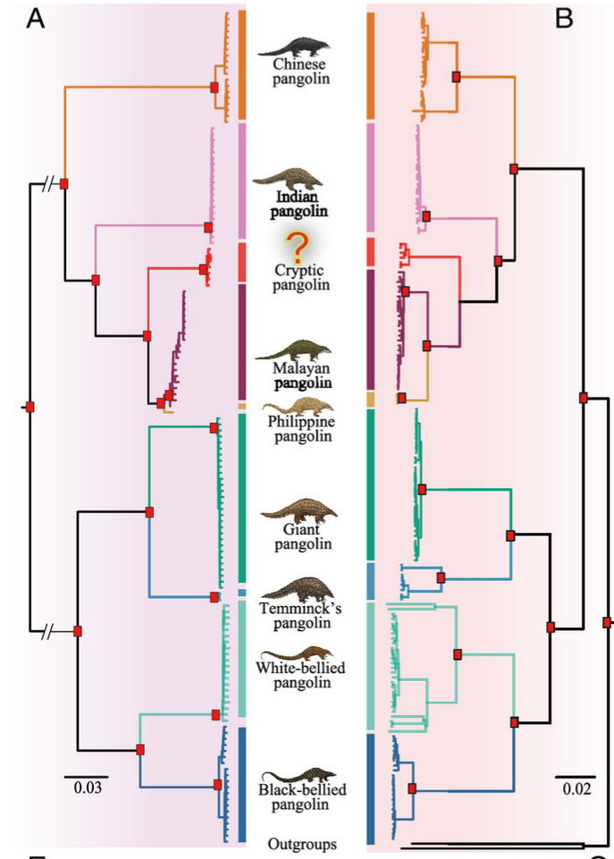

[@Gu2023]

## Another example: *Aspergillus*

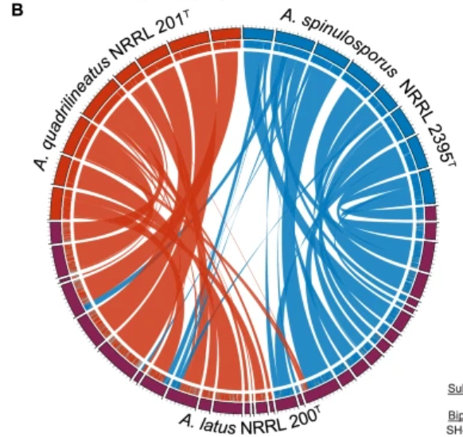

[@Steenwyk2024]

## And they can be old!

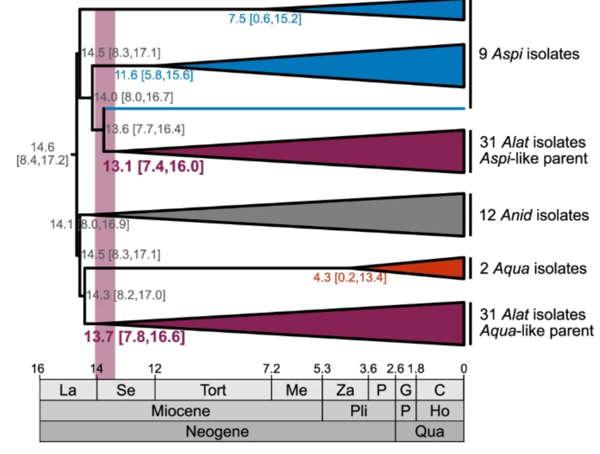

## And another one:

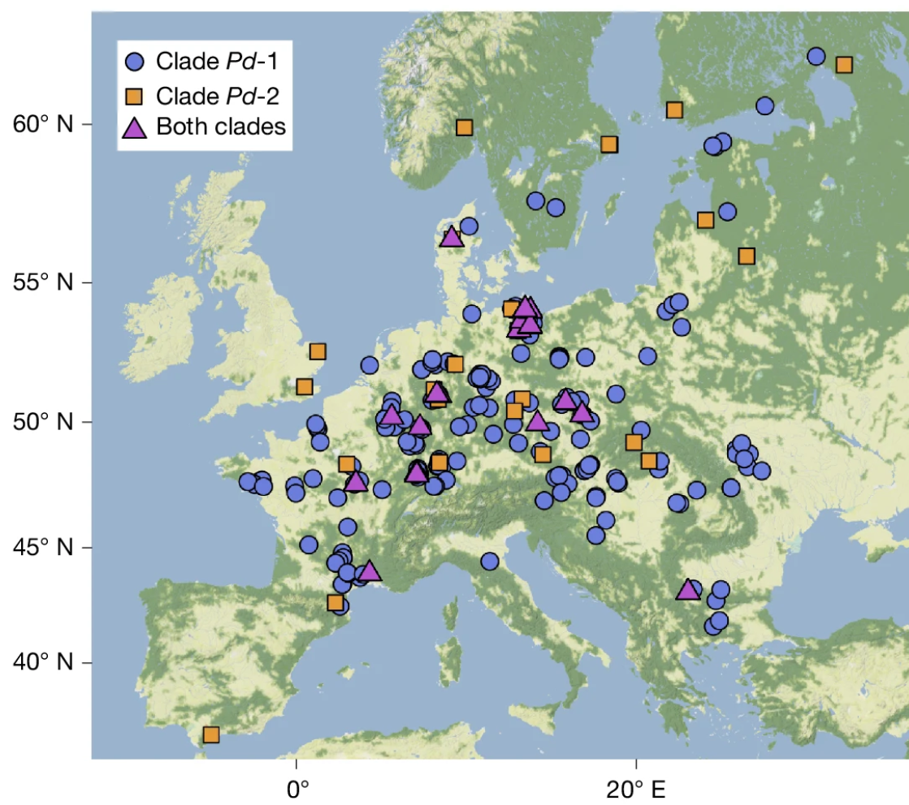

[@Fischer2025]

## Best approaches for structure detection

Rough scan of clustering in PCA space to start.

. . .

Run *`fastStructure`*, *`PCANGSD`* , `ADMIXTURE`

. . .

Be aware that obvious clustering can occur due to over-sampling particular locations/families.

. . .

And consequently - phenotypic differences may not be unique to clusters.

## What to do once you have it

Once you have identified population structure, it is worth asking if the trait you are interested in is limited/enhanced in some subpopulation.

. . .

If this is the case, you can follow some of the other approaches we identified previously (GWAS/PBS/QTL) to identify the genetic underpinnings of the trait.

. . .

If the trait is distributed across ancestries - GWAS, but keep in mind population structure as a co-variate.

## Step 2: Demography estimation {.smaller}

Demographic changes essentially introduce population structure, and so $h^2$ can appear to be elevated after a bottleneck.

. . .

Similarly, you may detect what looks like structure, even if it's a result of recent bottlenecking in some but not all of your samples.

. . .

If those samples are also differentiated phenotypically, this can drive you to see patterns of selection + multi-allelic differentiation.

. . .

There is no practical advice of how to "fix" a population with reduced genetic diversity following a bottleneck - these are simply constraints of biology.

## E.g.
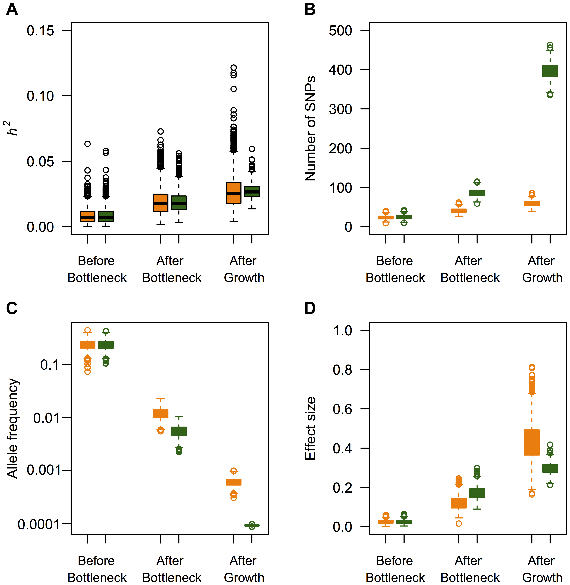

[@Lohmueller2014]

## Example: white sands lizards

Too many figures to list here, so [link](https://onlinelibrary.wiley.com/doi/full/10.1111/mec.13385).

## Demography: how to estimate {.smaller}

Depending on the number of groups, this can be extremely complex.

. . .

We've talked about several approaches to estimate demography, and we'll talk about more next week with ARG and SMC approaches.

. . .

Both still require some knowledge about population relationships, split timings, etc. to be efficient.

. . .

So, often first step is to generate gene trees across the genome, unless doing full ARG approach.

. . .

Alternative - run `PSMC` on individual genomes from different groups to obtain a rough idea of demography.

This is easy and quick, but many better methods exist if you are explicitly interested in demographic change.

## What to do once you have it

Be mindful that recent demographic changes may have erased/lessened signals of selection.

. . .

But, strong selection has probably caused a bottleneck in the whole genome.

. . .

So, a lack of any demographic change should inform what you think about trait evolution as well.

. . .

Local demographic estimates (using only regions near putative causal genes) can help inform the type/timing of selection as well.

## Step 3: Identify population differentiation

Look for where in the genome your populations are diverged.

. . .

If there are clear differences between parts of the genome and there are phenotypic differences - these are the places to start looking.

. . .

If only one of your populations shows some trait of interest, recall PBS

## PBS in cryptic coral

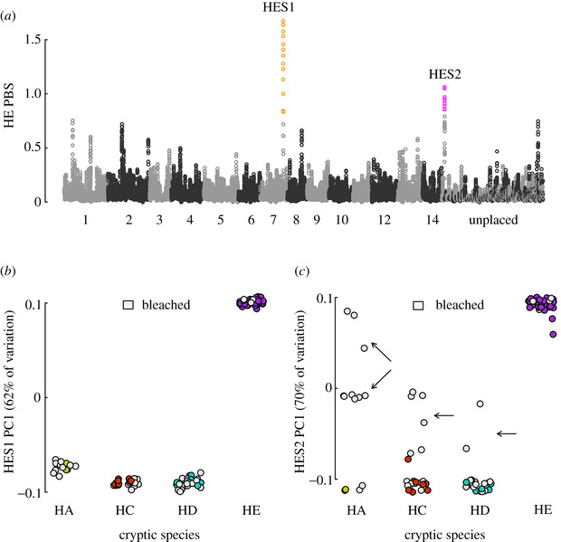

[@Rose2021]

## $F_{ST} !=$ selection

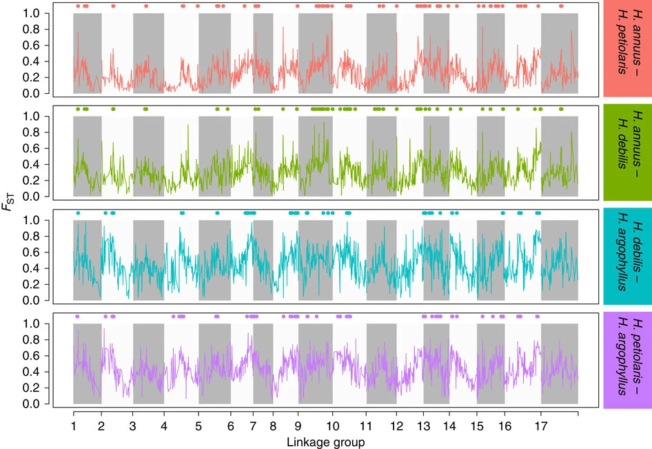

[@Renaut2013]

## Isolation by distance can look like selection

We've talked about clines/divergence among locally adapted populations.

. . .

But clines also naturally occur between populations when each subpopulation has limited migration to the next (island chain model).

. . .

How can we distinguish if a trait you are interested in is different not from geographic isolation, but because of selection?

## $Q_{ST}$ - $F_{ST}$ {.smaller}

A simple statistic to gauge whether your trait variation is commensurate with your genetic variation is the $Q_{ST}$ statistic = $ \frac{V_{AB}}{V_{AB}+V_{AW}} $, where $V_{AW}$ is additive variance within populations, $V_{AB}$ is between populations.

. . .

This is analogous to $F_{ST}$ (which asks what proportion of genetic variation is exclusive to each population), but asks what proportion of total *phenotypic* variation is exclusive to each population.

. . .

When $Q_{ST}$ exceeds genome-wide $F_{ST}$ - trait divergence faster than genetic: could be adaptation.

. . .

When $Q_{ST} \approx F_{ST}$ - could be traits diverging purely by drift.

## Example: Snapdragons
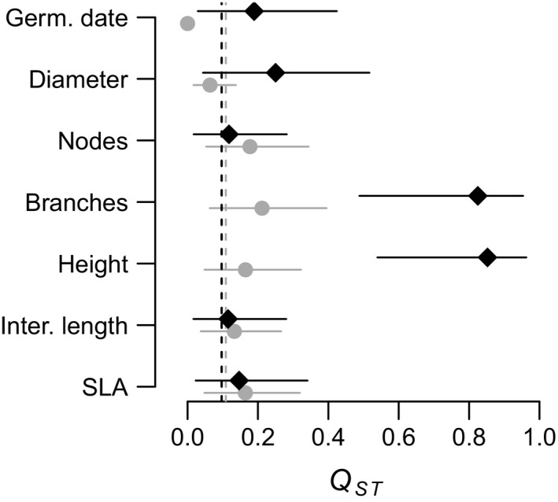
[@Marin2020]

## Introgression analyses?

As you identify demography and divergence, you may see that parts of the genome show much *less* divergence than you may have expected. This is a solid first tell for introgression.

. . .

Introgression introduces a second layer of population structure - within genome differences in structure.

. . .

If a locus adaptively introgresses, it may be highly structured across all samples as a single population, while the rest of the genome shows more ancestries.

. . .

Here, you can run simple ABBA-BABA tests to gauge evidence for introgression, or TWISST2 to look for regions with differing topologies.

## Example: butterflies

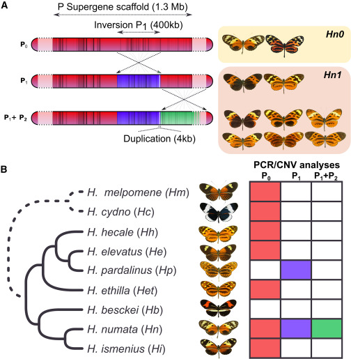

[@Jay2018]

## All along - avoid adaptationist arguments

We took a while to talk about selection this semester - by design.

. . .

Selection is often not the primary evolutionary force explaining genetic variation.

. . .

And, selection may not be ongoing in a population once you are studying the trait.

. . .

A fun example - cane toads in Australia.

## Cane Toads

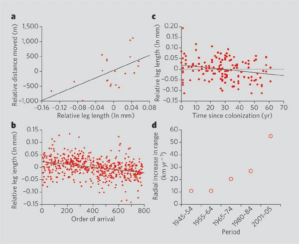

[@Phillips2006]

## What's selected may not be the trait you are focusing on

When we do talk about selection, it is worth considering arguments about the *levels of selection*.

. . .

We have been nice and vague and referred to fitness as the number of offspring produced, but we never really named what the *individual* being studied is.

. . .

Is it a gene (and offspring are gene copies?)

. . .

Is it a whole organism?

. . .

Is it groups of organisms?

. . .

Is it species?

## Big points

Selection *will* operate, and evolution *will* happen at any imaginable level if its main criteria are met:

. . .

-   There are differences in some trait among the population in the next generation.

-   That difference is in some ways heritable.

. . .

This is very vague, by design.

. . .

What levels of selection is selection *efficient* at?

## Confusions in trait selection - kin selection

When talking about group selection, a common argument is that *altruistic* traits cannot evolve as they would not be favored at the genic level.

. . .

Is this true?

. . .

Hamilton's Rule states that if $r B > C$, an "altruist" allele will spread.

. . .

Is this truly altruism?

## Some examples of confused levels of selection

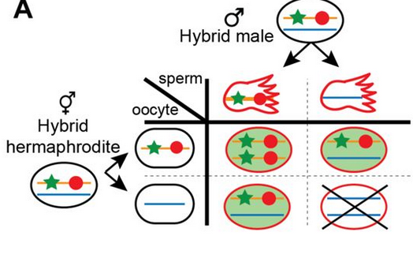{width="448"}

[@Long2023]

## Big Takeaways

Even if you are uninterested in the structure/demographic history of your populations, understanding them is crucial to understanding the actual traits you are interested in.

. . . 

Thankfully, many of the approaches to do broad population genetic analyses are becoming more standardized, and easier to achieve.

. . . 

Interpreting your trait evolution in light of this evolutionary history is still somewhat of an art - read lots of pop gen papers, expect the unexpected.

## Short Assignment 2

Due November 14th.

. . .

Initial analysis of your data: a markdown script of what analyses you have run, with included figures of what results you have so far.

. . .

Should include at least the first analysis we discussed in your one on one meetings - for many of you this is just looking for structure. `PCAngsd` is fine, or run `fastSTRUCTURE`, `ADMIXTURE`, etc.

. . .

Write-up should include what follow-up analyses are warranted for your end goal. For example - will you need to run demographic analysis? What approaches will you use?

## This week's reading

TREE paper on the effects of inversions in evolution.

. . . 

Inversions, by virtue of supressing recombination, have been considered as "supergenes" - carrying many alleles with various effects on potentially many traits.

. . . 

In empirical data - they turn out to have a variety of impacts on traits outside of suppressing recombination.

. . . 

More specifically, they'll point out some of the difficulties in validating evolutionary stories about inversion effects once the easy analyses are done.

## References