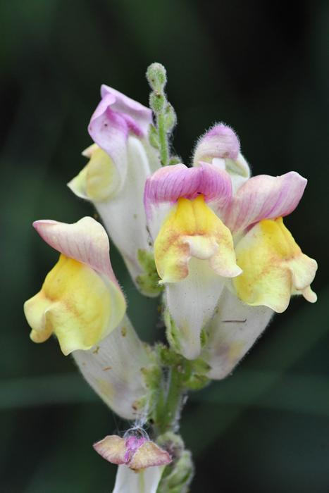

# Studying trait evolution when everything is complicated

## Today's plan

Regretably, most biologists are not population geneticists.

. . .

That means you might be interested in the actual traits of your population, not a hypothetical Platonic population size that would evolve *as if* that model developed 100 years ago we all like.

. . .

Inferring history of your populations is crucial to inform their trait evolution, as we have continuously shown, but how do you actually use all of this evolutionary history to say something about traits of interest?

## General course of action in a study

Get a good idea about population structure of your samples.

. . .

Population structure can lead to:

-   Inflated diversity at selected sites.
-   Increased divergence at unrelated sites.
-   Non-causal correlations with trait during GWAS
-   False inference of demography.

## Identifying structure can also lead to identifying cryptic species/variation

Another advantage of running this analysis first is that you may discover that a trait you *thought* was a local adaptation is actually indicative of a cryptic species.

. . .

[@Gu2023]

## Another example: *Aspergillus*

[@Steenwyk2024]

## And they can be old!

## And another one:

[@Fischer2025]

## Best approaches for structure detection

Rough scan of clustering in PCA space to start.

. . .

Run *`fastStructure`*, *`PCANGSD`* , `ADMIXTURE`

. . .

Be aware that obvious clustering can occur due to over-sampling particular locations/families.

. . .

And consequently - phenotypic differences may not be unique to clusters.

## Step 2: Demography estimation

[@Lohmueller2014]

## Demography can cause build up of correlations

Demographic changes essentially introduce population structure, and so $h^2$ can appear to be elevated after a bottleneck.

. . .

Similarly, you may detect what looks like structure, even if it's a result of recent bottlenecking in some but not all of your samples.

. . .

If those samples are also differentiated phenotypically, this can drive you to see patterns of selection + multi-allelic differentiation.

. . .

There is no practical advice of how to "fix" a population with reduced genetic diversity following a bottleneck - these are simply constraints of biology.

## Example: white sands lizards

Too many figures to list here, so [link](https://onlinelibrary.wiley.com/doi/full/10.1111/mec.13385).

## Demography: how to estimate

Depending on the number of groups, this can be extremely complex.

. . .

We've talked about several approaches to estimate demography, and we'll talk about more next week with ARG and SMC approaches.

. . .

Both still require some knowledge about population relationships, split timings, etc. to be efficient.

. . .

So, often first step is to generate gene trees across the genome, unless doing full ARG approach.

. . .

Alternative - run `PSMC` on individual genomes from different groups to obtain a rough idea of demography.

This is easy and quick, but many better methods exist if you are explicitly interested in demographic change.

## Step 3: Identify population differentiation

Look for where in the genome your populations are diverged.

. . .

If there are clear differences between parts of the genome and there are phenotypic differences - these are the places to start looking.

. . .

If only one of your populations shows some trait of interest, recall PBS

## PBS in cryptic coral

[@Rose2021]

## Just because there are $F_{ST}$ peaks, does not mean they are causal

On the other hand, you may find population differentiation, but it may not actually be the key to your trait evolution (although this is rare). They may just be driven by recombination!

. . .

[@Renaut2013]

## $Q_{ST}$ - $F_{ST}$

A simple statistic to gauge whether your trait variation is commensurate with your genetic variation is the $Q_{ST}$ statistic.

. . .

This is analogous to $F_{ST}$ (which asks what proportion of genetic variation is exclusive to each population), but asks what proportion of total *phenotypic* variation is exclusive to each population.

. . .

When $Q_{ST}$ exceeds genome-wide $F_{ST}$ - trait divergence faster than genetic: could be adaptation.

. . .

When $Q_{ST} \approx F_{ST}$ - could be traits diverging purely by drift.

## Example: Snapdragons

{width="121"}

[@Marin2020]

## Introgression analyses?

As you identify demography and divergence, you may see that parts of the genome show much *less* divergence than you may have expected. This is a solid first tell for introgression.

. . .

Introgression introduces a second layer of population structure - within genome differences in structure.

. . .

If a locus adaptively introgresses, it may be highly structured across all samples as a single population, while the rest of the genome shows more ancestries.

. . .

Here, you can run simple ABBA-BABA tests to gauge evidence for introgression, or TWISST2 to look for regions with differing topologies.

## Example: butterflies

[@Jay2018]

## Short Assignment 2

Due November 14th.

. . .

Initial analysis of your data: a markdown script of what analyses you have run, with included figures of what results you have so far.

. . .

Should include at least the first analysis we discussed in your one on one meetings - for many of you this is just looking for structure. `PCAngsd` is fine, or run `fastSTRUCTURE`, `ADMIXTURE`, etc.

. . .

Write-up should include what follow-up analyses are warranted for your end goal. For example - will you need to run demographic analysis? What approaches will you use?

## References